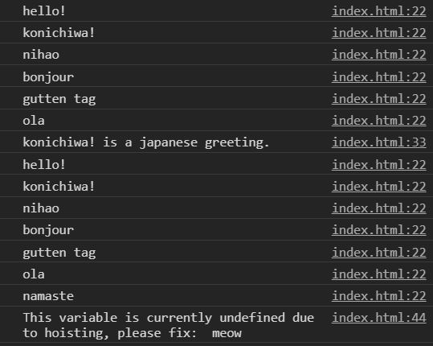

# javascript-es6-const-let

In this exercise you are going to convert a pre-made file's variables from `var` to `const` and `let`

### Before You Begin

Be sure to check out a new branch (**from master**) for this exercise. Detailed instructions can be found [**here**](../../guides/before-each-exercise.md).

### Exercise

1. Read about `const` and `let` [here](https://exploringjs.com/impatient-js/ch_variables-assignment.html).

1. Take a look at the provided `index.html` file.

1. Convert all the variables to `const` and `let`.  Make sure to use `const` and `let` appropriately.  Anything that can be a constant variable, should be a constant variable.  Feel free to move variables around or add extra if needed.

1. When turning in your work, make sure to refresh the page enough times to get to the `konichiwa! is a japanese greeting.` log to the console.

    

      
    

### Submitting Your Solution

When your solution is complete, change directories to the root of your lessons repository. Then commit your changes, push, and submit a Pull Request on GitHub. Detailed instructions can be found [**here**](../../guides/after-each-exercise.md).

### Quiz

- Variables defined with the `var` keyword are function scoped.  `const` and `let` are _____ scoped.
- Name some characteristics of a variable declared using `const`.
- Name some characteristics of a variable declared using `let`.
- What does block scope mean?
- In the file we can push a new value to an array defined using the `const` variable.  How does that work?
- Name some things that `var` can do that `const` and `let` can't.
- If `var` can be used virtually anywhere, why would we switch?
