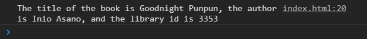
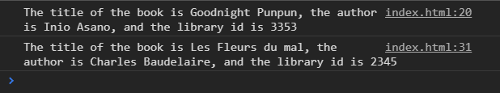
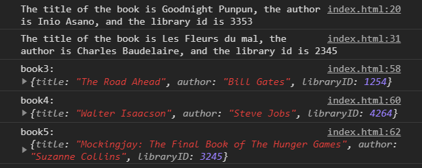
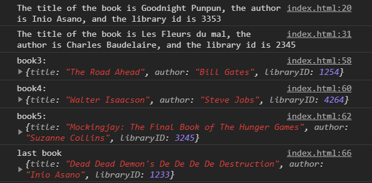

# javascript-es6-destructuring

In this exercise you are going to practice object and array destructuring.


### Before You Begin

Be sure to check out a new branch (**from master**) for this exercise. Detailed instructions can be found [**here**](../../guides/before-each-exercise.md).

### Exercise

1. Read about `destructuring` [here](https://exploringjs.com/es6/ch_destructuring.html).


1. Create an `index.html` and add a basic [HTML Skeleton](../html-skeleton/README.md).

1. Add a `<script>` tag at bottom of your `<body>` tag like so:

    ```html
      <body>
      <!-- your html goes here -->


      <script>
      //your javascript code goes here
      </script>
      </body>
    ```

    You may also create a `main.js` file and link it your `index.html` using a `<script>` tag.  However it must be linked at the bottom of the `<body>`.

1. Create an object literal with three properties, and assign it to a variable called book1.  Here are the properties and values.

    ```javascript
      title: "Goodnight Punpun",
      author: "Inio Asano",
      libraryID: 3353
    ```

1. `Destructure` the object to create three variables of the property names.

1. Create the following sentence using the variables and log it to the console.


    <p align='center'>
      
    </p>

1. Create another object literal with three properties, and assign it to a variable called `book2`.  Here are the properties and values.

    ```javascript
      title: "Les Fleurs du mal",
      author: "Charles Baudelaire",
      libraryID: 2345
    ```

1. `Destructure` the object to create three variables of the property names.  _Hint:  You will need to use [aliasing](https://davidwalsh.name/destructuring-alias) to not cause an issue with the variables you created earlier._

1. Create the following sentence using the variables and log it to the console.

    <p align='center'>
      
    </p>

1. Create an array of objects called `library`.  Here is some starter code.

    ```javascript
    const library = [
      {
        title: 'The Road Ahead',
        author: 'Bill Gates',
        libraryID: 1254
      },
      {
        title: 'Walter Isaacson',
        author: 'Steve Jobs',
        libraryID: 4264
      },
      {
        title: 'Mockingjay: The Final Book of The Hunger Games',
        author: 'Suzanne Collins',
        libraryID: 3245
      },
      {
        title: "Dead Dead Demon's De De De De Destruction",
        author: "Inio Asano",
        libraryID: 1233
      }
    ]
    ```

1. `Destructure` the array to get the first three objects in the array. Assign them to three variables called `book3`, `book4`, and `book5`.

1.  Log your three book objects to the console with appropriate console labels.

    <p align='center'>
      
    </p>

1.  `Destructure` the array to get the last object in the array. Assign it to a variable called `book6`. _[Hint](https://medium.com/the-andela-way/this-trick-will-help-you-de-structure-javascript-arrays-in-a-better-cleaner-way-a3bbc39ce226#48e2)_

1.  Log the last book object to the console with the appropriate console label.

    <p align='center'>
      
    </p>


### Submitting Your Solution

When your solution is complete, change directories to the root of your lessons repository. Then commit your changes, push, and submit a Pull Request on GitHub. Detailed instructions can be found [**here**](../../guides/after-each-exercise.md).

### Quiz

- When was destructuring introduced?
- Why could the running commas technique of destructuring an array be a bad idea?
- How can you easily tell the difference between destructuring and creating array/object literals.
