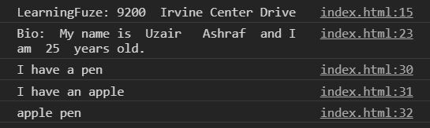

# javascript-es6-template-literals

In this exercise you are going to convert a pre-made file's string concatenation operations to `template literals`

### Before You Begin

Be sure to check out a new branch (**from master**) for this exercise. Detailed instructions can be found [**here**](../../guides/before-each-exercise.md).

### Exercise

1. Read about `template literals` [here](https://exploringjs.com/impatient-js/ch_template-literals.html#template-literals).

1. Take a look at the provided `index.html` file.

1. Convert all the string concatenation operations to template literals.  Make sure to not convert every single string into a template literal.  Only where they will be useful.

    

      
    

### Submitting Your Solution

When your solution is complete, change directories to the root of your lessons repository. Then commit your changes, push, and submit a Pull Request on GitHub. Detailed instructions can be found [**here**](../../guides/after-each-exercise.md).

### Quiz

- What is the syntax in writing a template literal?
- What is _string interpolation_?
