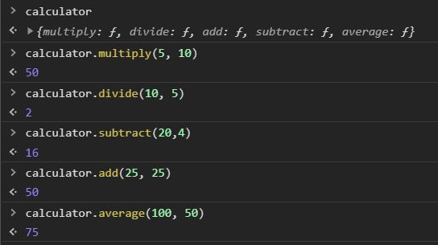

# javascript-oop-1

Intro to using methods in Object Oriented JavaScript

### Before You Begin

Be sure to check out a new branch (**from master**) for this exercise. Detailed instructions can be found [**here**](../../guides/before-each-exercise.md).

### Exercise


1. Read about **methods** on [MDN](https://developer.mozilla.org/en-US/docs/Web/JavaScript/Reference/Functions/Method_definitions)
1. Read pages 32 and 101 in _JavaScript and jQuery_ by Duckett.
1. Create an `index.html` and add a basic [HTML Skeleton](../html-skeleton/README.md).

1. Add a `<script>` tag at bottom of your `<body>` tag like so:

    ```html
      <body>
      <!-- your html goes here -->


      <script>
      //your javascript code goes here
      </script>
      </body>
    ```

    You may also create a `main.js` file and link it your `index.html` using a `<script>` tag.  However it must be linked at the bottom of the `<body>`.

1. Your task is to create an object to replicate the outcome in the screenshot below:

    <p align="center">
      
    </p>

1. Create an object literal named calculator with the following methods:

    -  multiply
        -  Takes two arguments
        -  Returns the result of the arguments being multiplied together

    -  divide
        -  Takes two arguments
        -  Returns the result of the arguments being divided into each other

    -  add
        -  Takes two arguments
        -  Returns the result of the arguments being added together

    -  subtract
        -  Takes two arguments
        -  Returns the result of the arguments being subtracted

    -  average
        -  Takes two arguments
        -  Returns the average of the two arguments
        -  **Bonus Requirement**:
            Use the add and divide methods on this object to get the result.  Make sure to also use the `this` keyword.

### Submitting Your Solution

When your solution is complete, change directories to the root of your lessons repository. Then commit your changes, push, and submit a Pull Request on GitHub. Detailed instructions can be found [**here**](../../guides/after-each-exercise.md).

### Quiz

- What is a method?
- What does a method do?
