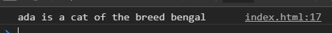
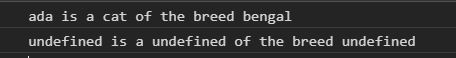
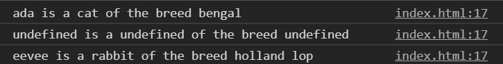
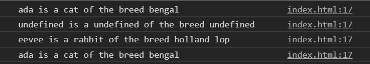

# JavaScript-OOP-2

Intro to using this in Object Oriented JavaScript

This exercise requires you to be curious to truly understand how **this** works.  Do your best and remember to **look around you**

### Before You Begin

Be sure to check out a new branch (**from master**) for this exercise. Detailed instructions can be found [**here**](../../guides/before-each-exercise.md).

### Exercise

1. Read pages 114 and 115 in _JavaScript and jQuery_ by Duckett.
1. Read about **this** on [MDN](https://developer.mozilla.org/en-US/docs/Web/JavaScript/Reference/Operators/this)
1. Create an `index.html` and add a basic [HTML Skeleton](../html-skeleton/README.md).

1. Add a `<script>` tag at bottom of your `<body>` tag like so:

    ```html
      <body>
      <!-- your html goes here -->


      <script>
      //your javascript code goes here
      </script>
      </body>
    ```

    You may also create a `main.js` file and link it your `index.html` using a `<script>` tag.  However it must be linked at the bottom of the `<body>`.

1. Create an object literal named `ada` with the three following properties:

    ```javascript
      title: 'ada',
      species: 'cat',
      breed: 'bengal',
    ```

1.  Add a method to the `ada` object called describe.  Using the this keyword to reference the properties on the `ada` object to console log the following sentence

1.  Call the describe method on the ada object and check your console.

    <p align="center">
      
    </p>

    Seems pretty normal right? Alright lets get weird.

1.  Declare a variable called describe and assign the describe method of the ada object to it like so:

    ```javascript
    var describe = ada.describe;
    ```

1.  Now call the describe function and check your console.

    <p align="center">
      
    </p>

1.  You may have one of the three following reactions:
    <div align="center">
      
      
      
    <div>

    The value of the keyword `this` is decided at call time.  When you called the decide function, `this` became the window.  Be sure to bring this up during Q and A!


1. Create an object literal named `eevee` with the three following properties:

    ```javascript
      title: 'eevee',
      species: 'rabbit',
      breed: 'holland lop',
    ```

1.  Add a property to the `eevee` object called describe and assign it the describe variable you created earlier:

    ```javascript
    eevee.describe = describe;
    ```

1.  Call the describe method on the eevee object and check your console.

    <p align="center">
      
    </p>


1.  Create an object literal named `pixel` with the three following properties:

    ```javascript
      title: 'pixel',
      species: 'dog',
      breed: 'corgi'
    ```

1.  Call the `bind` method on the describe object of the eevee object, pass the `ada` object as an argument, and assign the return value to the describe property on the `pixel` object.

    ```javascript
    pixel.describe = eevee.describe.bind(ada)
    ```

1. Call the describe method on the pixel object and check your console.

    <p align="center">
      
    </p>

1. Checkout this video for more information on [this and bind](https://youtu.be/GhbhD1HR5vk?t=582)
### Submitting Your Solution

When your solution is complete, change directories to the root of your lessons repository. Then commit your changes, push, and submit a Pull Request on GitHub. Detailed instructions can be found [**here**](../../guides/after-each-exercise.md).

### Quiz

- What is `this`?
- What does bind do?
- What is the difference between a function and an object literal?
