# javascript-oop-3

Intro to prototypes in Object Oriented JavaScript

This exercise will be handling fairly advanced topics in JavaScript.  The instructions, much like the previous exercises, will require you to explore things in the console and require you to **look around you**

### Before You Begin

Be sure to check out a new branch (**from master**) for this exercise. Detailed instructions can be found [**here**](../../guides/before-each-exercise.md).

### Exercise


1. Read about **Prototypes** on [MDN](https://developer.mozilla.org/en-US/docs/Learn/JavaScript/Objects/Object_prototypes)
1. Read about **Object.create()** on [MDN](https://developer.mozilla.org/en-US/docs/Web/JavaScript/Reference/Global_Objects/Object/create)
1. Create an `index.html` and add a basic [HTML Skeleton](../html-skeleton/README.md).

1. Add a `<script>` tag at bottom of your `<body>` tag like so:

    ```html
      <body>
      <!-- your html goes here -->


      <script>
      //your javascript code goes here
      </script>
      </body>
    ```

    You may also create a `main.js` file and link it your `index.html` using a `<script>` tag.  However it must be linked at the bottom of the `<body>`.

1. Create an object literal, empty string, and an array literal and assign them to variables.

1.  Call the dir method on the console object and pass the object literal you created as an argument.

1.  Checkout the console and have a look at the `__proto__` property on the Object literal you created.

    <p align="center">
      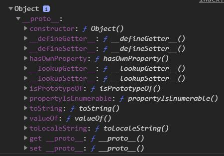
    </p>

    Woa, when did we add all of these methods on to the object?  We didn't right? Where did they come from?

1.  Call the dir method on the console object and pass the empty string you created as an argument, but add `.__proto__` at the end.

    ```javascript
    console.dir(string.__proto__);
    ```

1.  Take a look at your console.

    <p align="center">
      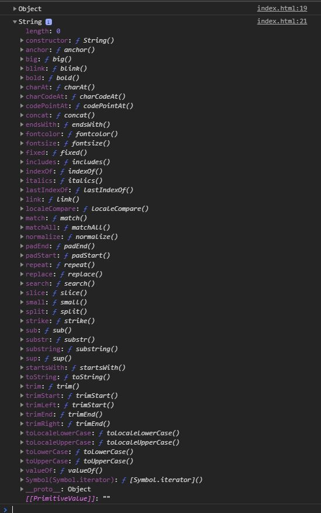
    </p>


    Woa woa woa woa woaaaaa.  What are all these methods?
    I'm sure at this point you have heard that everything in javascript is an object.  The `__proto__` property holds all of the methods that JavaScript prototypes onto your objects for you.

    But there is one more thing that we need to take a look at.  There is **ANOTHER** `__proto__` property on the `__proto__` property of the empty string we created.  Lets open it up and have a look.

    <p align="center">
      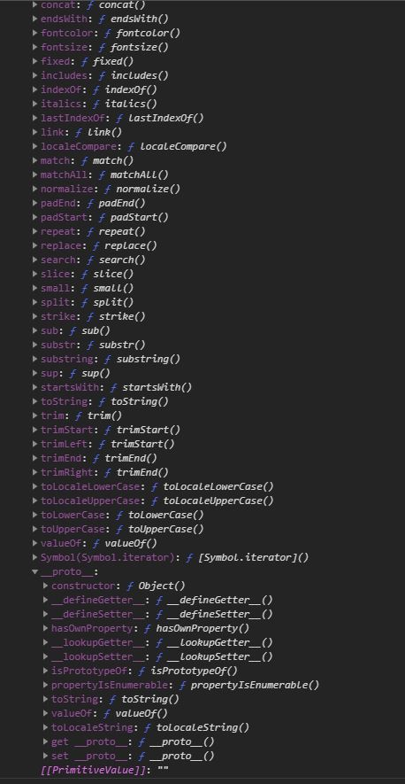
    </p>

    Well that `__proto___` property looks familiar right?  It is the same property we saw earlier on your empty object literal.  And I don't mean they are alike, I mean they are **literally the same** object. So how does this work?

    **PROTOTYPAL INHERITANCE**

    Here is a small diagram of what you are experiencing right now.

    <p align="center">
      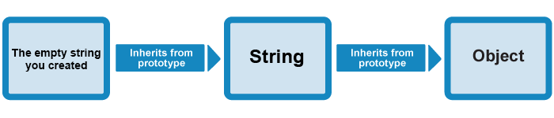
    </p>

    When you created your string the `String.prototype` was **linked** to the string's `__proto__` property.  The `Object.prototype` is **linked** to the `String.prototype`.

    Here is a fun little way to give that knowledge a more solid foundation.

    <p align="center">
      
    </p>

1. Create an object literal with two properties.

    ```javascript
      name: "Scott Bowler",
      hobbies: "Diet coke"
    ```

1. Call the `hasOwnProperty` method on the object you created and pass the string 'name' as an argument. Log the return value to the console.

    <p align="center">
      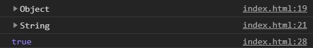
    </p>

    The `hasOwnProperty` method returns a boolean indicating whether the object has the specified property as its own property (as opposed to inheriting it).

1.  Go ahead and log that object to the console.

    <p align="center">
      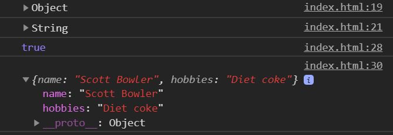
    </p>

    Notice how the object itself does not have a method called `hasOwnProperty`.  But when I magically call `obj1.hasOwnProperty('name')`.  JavaScript automatically finds that method for me.  Instead of me having to do something weird like `obj1.__proto__.hasOwnProperty('name')`.  This process is known as...

    **TRAVERSING UP THE PROTOTYPE CHAIN**

    When you call a method off of anything in Javascript.  If JavaScript does not find the method in its own properties, it will look up the prototypal chain for the method.  If it does not find it there it will check the next prototype in the chain.  If it hits the end of the chain and cannot find another `__proto__` to jump to.  It will throw an error.  We will experience that next.

1.  Create an object by calling Object.create and passing `null` as the argument.

    ```javascript
    var emptyObject = Object.create(null);
    ```

1.  Add two properties to the object and log it to the console

    ```javascript
    emptyObject.name = "Tim Davis";
    emptyObject.hobbies = "Smash Bros";
    ```

    <p align="center">
      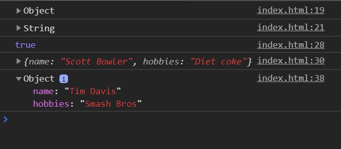
    </p>

    This is an object that was created without inheriting a prototype from other classes.  You can see that by noticing it does not have an `.__proto__` property.  Just to be sure, lets test that theory.

1.  Call the `hasOwnProperty` method on the empty object you created and pass the string 'name' as an argument. Log the return value to the console.

    <p align="center">
      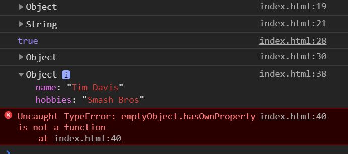
    </p>

    **oops, we messed up**
    -
    <p align="center">
      
    </p>

    So now you understand how **Prototypal Inheritance** and **Traversing up the Prototypal Chain** works.  But you also may be wondering,  how do I create my own prototype?  Don't I get the option to make my own custom prototype so I can make cool custom objects?

    Go ahead and comment out/delete the mistake we made in this step and move to the next step.

1.  In this step we will be creating an object that will be used as the prototype for other objects.  You will also see how useful the this keyword is. Create an object literal with three methods.

    ```javascript
    var carInfoPrototype = {
      overview: function () {
        console.log('The cars make and model is ' + this.make + ' ' + this.model)
      },
      specs: function() {
        console.log('The car weighs ' + this.weight + ' and has ' + this.horsePower + ' horsepower')
      },
      design: function() {
        console.log('The cars color is ' + this.color + ' and has ' + this.doors + ' doors.')
      }
    }
    ```

1.  Call the `create` method on the global `Object` and pass the prototype object you created as an argument and assign the return value to a variable.

1.  Log it to the console and have a look!

    <p align="center">
      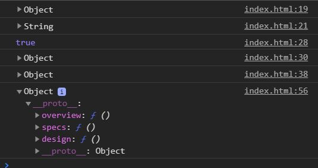
    </p>

    WOWEEE.  We've added our own prototype!  Lets make use of it now.

1.  Using dot notation, add the following properties to the object you created with your custom prototype.  We are using a fiat as an example but feel free to look up any car you want to use.

    ```javascript
    fiat.make = 'fiat';
    fiat.model = '500';
    fiat.weight = '500kg';
    fiat.horsePower = 200;
    fiat.color = 'white';
    fiat.doors = 4;
    ```

1.  Call the three methods on your object and have a look at your console.

    <p align="center">
      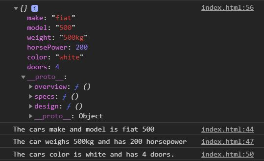
    </p>

1.  Create another object with another car's specifications using the same technique you did in the last couple steps.

    <p align="center">
      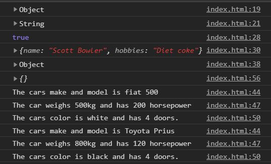
    </p>

    And there you go! Custom objects!  You may be wondering to yourself,  "Hmm this is pretty tedious, I'm sure there is a better way to create custom objects in this day and age."  Well you are correct!  We will see that in the next exercise.


### Submitting Your Solution

When your solution is complete, change directories to the root of your lessons repository. Then commit your changes, push, and submit a Pull Request on GitHub. Detailed instructions can be found [**here**](../../guides/after-each-exercise.md).

### Quiz

-  What is Prototypal Inheritance?
-  What is the Prototypal Chain?
-  In the custom objects we created, I noticed that our prototype object has another `__proto__` property, where did that come from?
-  Why does JavaScript have Prototypal Inheritance?
