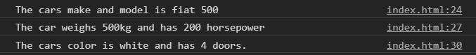
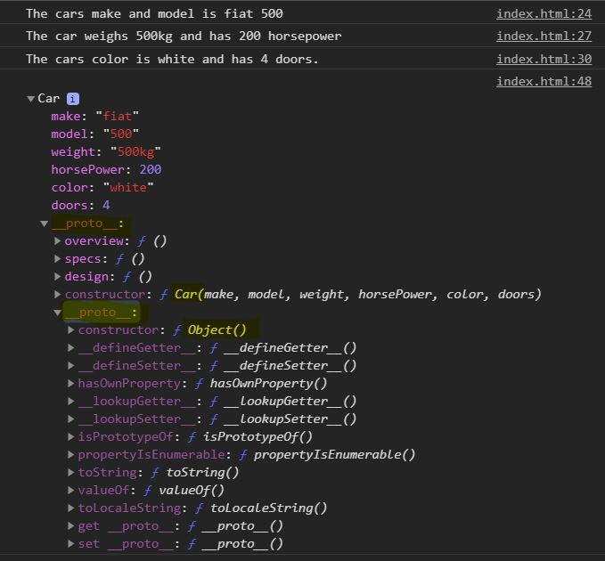
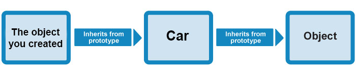
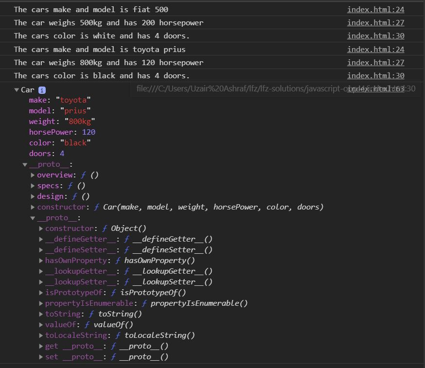

# javascript-oop-4

Intro to constructor functions in Object Oriented JavaScript

### Before You Begin

Be sure to check out a new branch (**from master**) for this exercise. Detailed instructions can be found [**here**](../../guides/before-each-exercise.md).

### Exercise


1. Read about **Constructor functions** on pages 108 and 109 on _JavaScript and jQuery by Jon Duckett_.
1. Read about the **new** operator on [MDN](https://developer.mozilla.org/en-US/docs/Web/JavaScript/Reference/Operators/new)
1. Check out some of the examples on using **Constructor functions** on [MDN](https://developer.mozilla.org/en-US/docs/Web/JavaScript/Reference/Global_Objects/Object/constructor#Examples)
1. Create an `index.html` and add a basic [HTML Skeleton](../html-skeleton/README.md).

1. Add a `<script>` tag at bottom of your `<body>` tag like so:

    ```html
      <body>
      <!-- your html goes here -->


      <script>
      //your javascript code goes here
      </script>
      </body>
    ```

    You may also create a `main.js` file and link it your `index.html` using a `<script>` tag.  However it must be linked at the bottom of the `<body>`.

1. Define a function name Car.

    <sup>Notice the capital "C"</sup>

1.  The function takes six parameters.

    ```javascript
    function Car(make, model, weight, horsePower, color, doors) {

    }
    ```

1. Using the `this` keyword, assign the parameters to the properties with the same names on the this object.

    ```javascript
    function Car(make, model, weight, horsePower, color, doors) {
      this.make = make;
      this.model = model;
      this.weight = weight;
      this.horsePower = horsePower;
      this.color = color;
      this.doors = doors;
    }
    ```

1. Assign three methods to Car function's prototype to simulate what we did in the last exercise.  I will include the expected outcome in the console in the method's respective code blocks.  Remember to use the `this` keyword effectively.

    ```javascript
    Car.prototype.overview = function() {
      //The cars make and model is (make) (model)
    }
    Car.prototype.specs = function() {
      //The car weighs (weight) and has (horsePower) horsepower.
    }
    Car.prototype.design = function() {
      //The cars color is (color) and has (doors) doors.
    }
    ```

1.  Using the `new` operator and the Car constructor function, pass in the arguments from the previous exercise to simulate the specifications of a fiat, and assign the return value to a variable. Here are the specs from the last exercise.
    ```javascript
      'fiat',
      '500',
      '500kg',
      200,
      'white',
      4
    ```

1. Once you have created your new object, call the three methods you created (overview, specs, and design) and check your console.

    <p align="center">
      
    </p>

1. Log the object you created to the console and take a look.

    <p align="center">
      
    </p>

    Neat right?  You can witness the Prototypal Inheritance. Here is a small diagram of what is happening right now.

    <p align="center">
      
    </p>

1.  Create another object with another car's specifications using the same technique you did in the last step.

    <p align="center">
      
    </p>

    And that is how constructor functions work!  But what if I were to tell you that there is actually a new way to do this using ES6/ES2015 JavaScript?  More on that in the next exercise.

### Submitting Your Solution

When your solution is complete, change directories to the root of your lessons repository. Then commit your changes, push, and submit a Pull Request on GitHub. Detailed instructions can be found [**here**](../../guides/after-each-exercise.md).

### Quiz

-  What does the new keyword do?
-  I could've added a method to the constructor function by assigning a method to a property on the this object.  Why do we have to add it to the prototype property?
