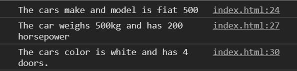
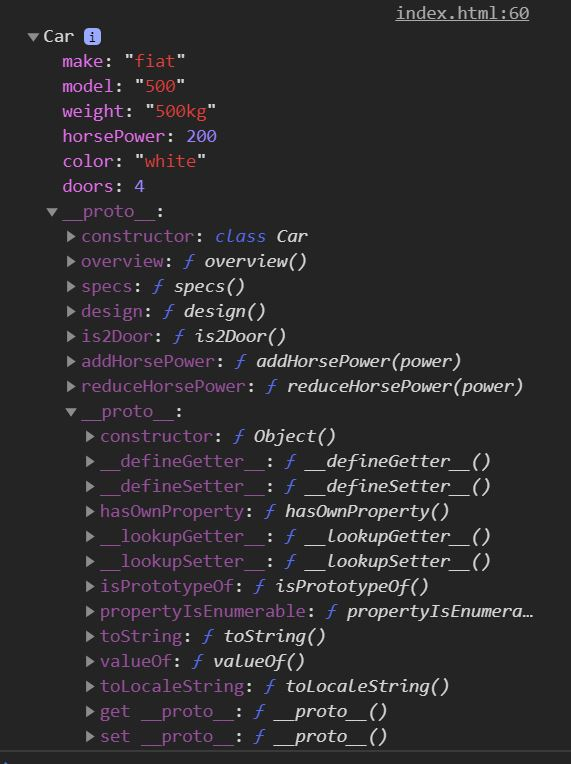
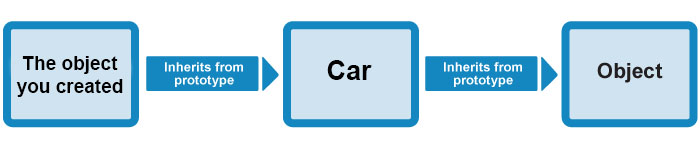
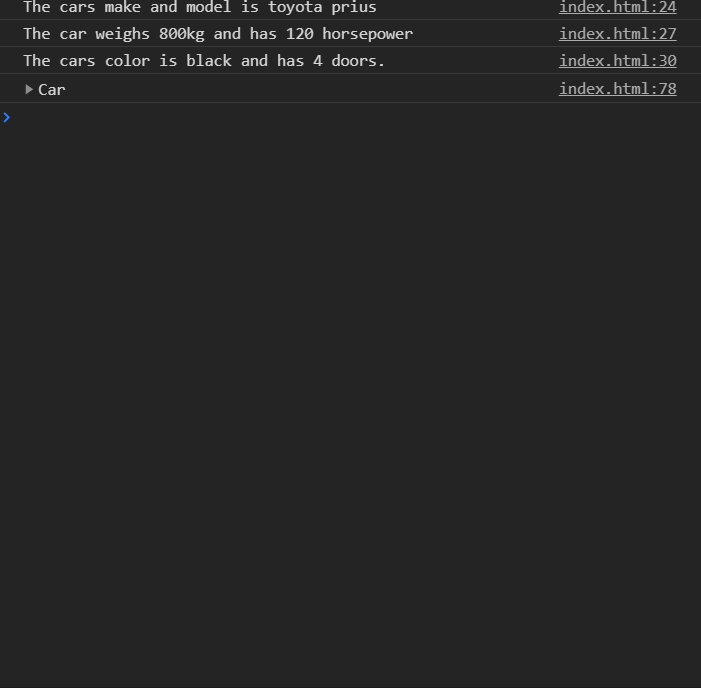

# javascript-oop-5

Intro to Classes in Object Oriented JavaScript

### Before You Begin

Be sure to check out a new branch (**from master**) for this exercise. Detailed instructions can be found [**here**](../../guides/before-each-exercise.md).

### Exercise


1. Read about **Classes** on [MDN](https://developer.mozilla.org/en-US/docs/Web/JavaScript/Reference/Classes)
1. If you would like a refresher on the **new** operator feel free to check it out again on [MDN](https://developer.mozilla.org/en-US/docs/Web/JavaScript/Reference/Operators/new)
1. Create an `index.html` and add a basic [HTML Skeleton](../html-skeleton/README.md).

1. Add a `<script>` tag at bottom of your `<body>` tag like so:

    ```html
      <body>
      <!-- your html goes here -->


      <script>
      //your javascript code goes here
      </script>
      </body>
    ```

    You may also create a `main.js` file and link it your `index.html` using a `<script>` tag.  However it must be linked at the bottom of the `<body>`.

1. Define a class name Car.

    ```javascript
      class Car {

      }
    ```

1.  Add a constructor takes six parameters.

    ```javascript
    class Car {
      constructor(make, model, weight, horsePower, color, doors) {

      }
    }
    ```

1. Using the `this` keyword, assign the parameters to the properties with the same names on the this object.

    ```javascript
    class Car {
      constructor(make, model, weight, horsePower, color, doors) {
        this.make = make;
        this.model = model;
        this.weight = weight;
        this.horsePower = horsePower;
        this.color = color;
        this.doors = doors;
      }
    }
    ```

1. Add three methods to the Car class to simulate what we did in the last exercise.  I will include the expected outcome in the console in the method's respective code blocks.  Remember to use the `this` keyword effectively.

    ```javascript
    class Car {
      constructor(make, model, weight, horsePower, color, doors) {
        this.make = make;
        this.model = model;
        this.weight = weight;
        this.horsePower = horsePower;
        this.color = color;
        this.doors = doors;
      }
      overview() {
      //The cars make and model is (make) (model)
      }
      specs() {
        //The car weighs (weight) and has (horsePower) horsepower.
      }
      design() {
      //The cars color is (color) and has (doors) doors.
      }
    }
    ```

1. Add three more methods to your Car class that complete the following tasks.  Remember to use the `this` keyword effectively.

    -  is2Door
        -  Takes no arguments
        -  Check if the car has 2 doors
        -  Return true and false

    -  addHorsePower
        - Takes one argument of `power`
        - Adds the argument of `power` to the `horsePower` property.
        - returns the new value of the `horsePower` property

    -  reduceHorsePower
        - Takes one argument of `power`
        - Subtracts the argument of `power` to the `horsePower` property.
        - returns the new value of the `horsePower` property

1.  Using the `new` operator and the Car class, pass in the arguments from the previous exercise to simulate the specifications of a fiat, and assign the return value to a variable.  Here are the specs from the last exercise.

    ```javascript
      'fiat',
      '500',
      '500kg',
      200,
      'white',
      4
    ```

1. Once you have created your new object, call the first three methods you created (overview, specs, and design) and check your console.

    <p align="center">
      
    </p>

1. Go ahead and test the three methods you created in the console.

    - is2Door

    <p align="center">
      
    </p>

    - addHorsePower

    <p align="center">
      
    </p>

    - reduceHorsePower

    <p align="center">
      
    </p>

    If you are getting a different outcome please go back and fix your methods.

1. Log your object to the console and have a look.

    <p align="center">
      
    </p>

    Look familiar right?

    <p align="center">
      
    </p>

1.  Create another object with another car's specifications using the same technique you did in the last step.

    <p align="center">
      
    </p>

    And that is how classes work!  This is the standard way of making custom objects in this day and age.  You will be using classes much more often in the program now.  Be sure to read up on them more because they will be very useful in the near future!

### Submitting Your Solution

When your solution is complete, change directories to the root of your lessons repository. Then commit your changes, push, and submit a Pull Request on GitHub. Detailed instructions can be found [**here**](../../guides/after-each-exercise.md).

### Quiz

-  What is the first thing that happens in a class when it is instantiated with the new keyword?
-  Since classes are technically functions as well. Can you name a difference between classes and functions?
-  What is a static method?
