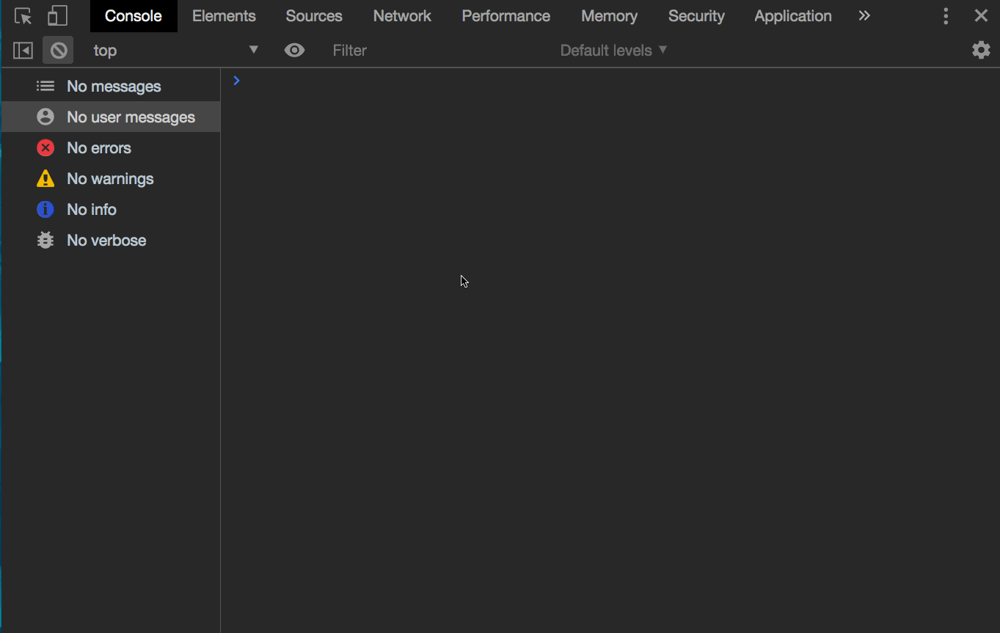
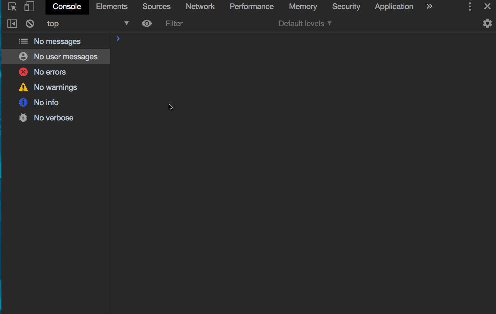

# JavaScript OOP Parent Child 1

Instantiation of objects (and how to use instantiation to create familial relationships between objects) is a tricky part of understanding OOP.

But, it is also a very important part of "modeling the real world", which is in large part the purpose of using OOP.

Take a moment and imagine a real world entity such as a bank. In its simplest form, a bank is a "collection" of  accounts. Each account contains information on the owner of the account, the amount of money stored in it, and the history of transactions.

Now imagine that you want to model that bank functionality using `Objects`.

- First you create a `account` object template which has the functionality to store money, add money, subtract money, and track transactions.
- Next you create a `bank` object template which has the functionality to create accounts, store accounts, delete accounts, and update accounts.
- With you object templates complete, you would then `instantiate` the `bank` object...
- And then use the instantiated `bank` object to instantiate `account` objects as they are required.

In the above example, you are creating a `parent-child` relationship between the objects in which the `bank` is the parent of all the `account` objects.

`Parent - child` relationships are very useful for the "real world modeling" nature of OOP, as it allows the developer to easily organize code in a way which does model the functionality of real world "objects" such as the `banks` and `accounts` in the above example.

In the following exercise, you are going to be creating a `Parent` class that will instantiate a `Child` class which will model a common "real world" experience in which a child is asking their parent for something to eat.

So with that intro out of the way, Let's get started!

### Before You Begin

Be sure to check out a new branch (**from master**) for this exercise. Detailed instructions can be found [**here**](../../guides/before-each-exercise.md).

### Exercise

1. Open and read the MDN documentation on `Object-oriented JavaScript for beginners` [**Click Here**](https://developer.mozilla.org/en-US/docs/Learn/JavaScript/Objects/Object-oriented_JS)
2. Create an `index.html` and `main.js` file in the `javascript-oop-parent-child-1` folder, and prepare them for writing JavaScript code.
3. In the `main.js` file, do the following:
    - Declare a `Parent` class with the following `constructor` parameters:
        - firstName - which will receive a first name (string) as an argument.
        - lastName - which will receive a last name (string) as an argument.
        - age - which will receive an age (number) as an argument.
        - job - which will receive a job (string) as an argument.
        - childName - which will receive a name (string) as an argument
            - this name will be used for the child object which will be instantiated later.
    - Within the `Parent` class constructor:
        - assign each of the parameter values to an appropriate property
            - Example:
            ``` javascript
            this.firstName = firstName
            ```

    - Next, Declare a `Child` class in the `main.js` file with the following `constructor` parameters:
        - parentName - which will receive the parents first name (string) as an argument.
        - name - which will receive the child's name (string) as an argument.
    - Within the `Child` class constructor:
        - assign each of the parameter values to an appropriate property
    - Now, instantiate a new `Child` class in the `constructor` of the `Parent` Class:
        - Pass in the appropriate arguments to the `Child` class constructor when it is instantiated.
        - assign the newly instantiated `child` object to a property in the `constructor` named `this.child`
    - Now it is time to test!
        - within main.js:
            - instantiate your `Parent` class with appropriate arguments and store the instantiated object in a variable named `parent`.
        - now, open the `index.html` file, and then open the console and check for any errors.
        - if there are errors:
            - update the code to fix them, then move on
        - if there are no errors:
            - console log the `parent` variable to confirm you have properly instantiated the class.
            - Example functionality:
            
    - Now that you are properly instantiating the `Parent` and `Child` classes, its time to add a method to the `Child` class.
    - Within the `Child` class:
        - declare a new method named `askForFood`
        - within the `askForFood` method:
            - console log a string in which the child asks their parent for food by concatenating the `parentName` into the string.
            - Example functionality:
            
    - Once you have called the `askForFood` method in the console and received the proper console log, Congratulations! You have properly instantiated a `child` object within a `parent` object and included a method on the child which references data from the parent!!!
    - Move on to the `Submitting Your Solution` section!
        - Don't worry, we will add functionality to feed the child in the next version!


### Submitting Your Solution

When your solution is complete, change directories to the root of your lessons repository. Then commit your changes, push, and submit a Pull Request on GitHub. Detailed instructions can be found [**here**](../../guides/after-each-exercise.md).

### Quiz

- What is the benefit of instantiating Classes within other classes?
- Why are parent - child relationships important in OOP?
- What is the basic idea of OOP?
