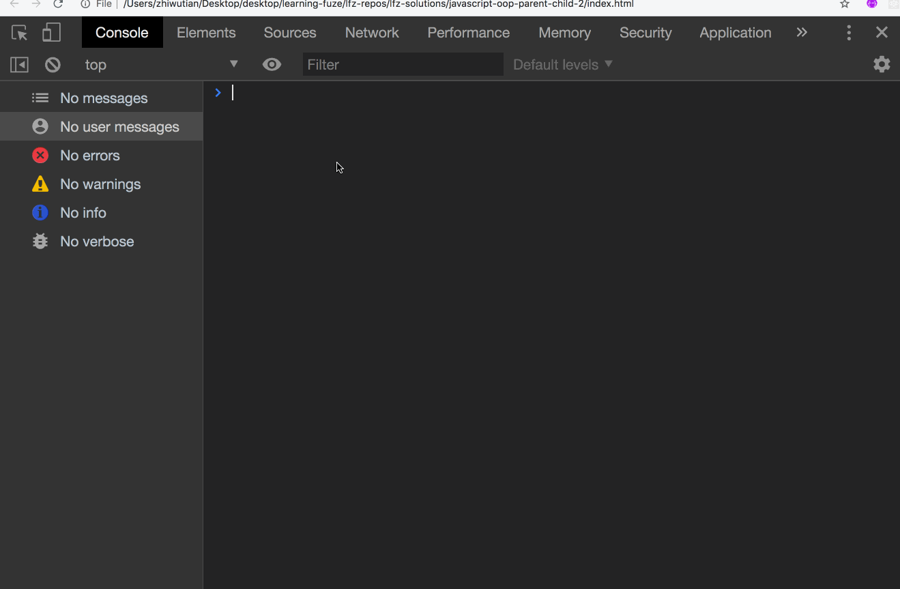

# javascript-oop-parent-child-2

Now that you have an understanding of instantiating objects as children of other objects, it is time to develop the next skill which is very important in OOP, communication between objects through callback functions!

In our previous exercise, you created `Parent` and `Child` classes and used the `Parent` class to `instantiate` the `Child` class. You then created a method on the `Child` class which allows the instantiated child to request food from the instantiated parent.

In this exercise, you will be adding a food supply to the `Parent` class, and a new method, `feedChild` which will be passed in to the `Child` class when it is instantiated so that the instantiated child can use the `feedChild` method to receive food from its instantiated parent.

So now that we have outlined the functionality for this exercise, let's get started!

### Before You Begin

Be sure to check out a new branch (**from master**) for this exercise. Detailed instructions can be found [**here**](../../guides/before-each-exercise.md).

### Exercise

1. It is recommended that you reference the following OOP exercises and their documentation while completing this exercise:
    - `oop-2` - for its information on `this` and `bind`
    - `parent-child-1` - for the `Parent` and `Child` classes
2. Create an `index.html` file and a `main.js` file and prepare them to run JavaScript code.
3. In the `main.js` file:
    - Create the `Parent` and `Child` classes from the previous exercise:
        - Do not copy and paste them, take the time to type out all of the code, you want as much practice actually creating classes as possible!
        - Instantiate them in the same way as the previous exercise.
        - Confirm that you have all of the previous functionality before moving on!
    - Within the `Parent` class:
        - add a new property in the constructor:
            - `this.food`
            - assign it an initial value of `5`
        - create a new method:
            - `feedChild`
            - Within the method:
                - check if the `this.food` property has a truthy value:
                    - if it does, decrease the value of the `this.food` property by `1`
                    - log a message to the console that tells the child how much food is left.

                - If the `this.food` property has a falsy value:
                    - log a message to the console letting the child know that there is no food left.

        - It's time to test!
            - Call your `feedChild` method in the console to confirm it is properly decrementing the `this.food` property, and that when the food runs out, an appropriate message is logged to the console.
            - Example functionality:
            ;
        - When the `feedChild` method is working properly, move on to the next step.
    - Now that the `feedChild` method is working correctly, it is time to give the `feedChild` method to the `Child` class when it is instantiated so that the instantiated child can use it to get food from it's parent!
        - First, bind `this` to the `feedChild` method in the `Parent` constructor so that when it is called, the `this` in its code block will still refer to the instantiated parent object:

            ```javascript
            this.feedChild = this.feedChild.bind(this);
            ```
        - Now, pass in the `feedChild` method as a third argument when you instantiate the `Child` class within the `Parent` class.
        - This concludes your work in the `Parent` class.
    - Within the `Child` class:
        - Add a third parameter to the `constructor` named `feedMeCallback`
            - this new parameter will be used to store the `feedChild` method being passed as the third argument when the `Child` is instantiated.
        - Assign the `feedMeCallback` method to an appropriately named property in the constructor.
        - Now, call the `feedMeCallback` method within the `askForFood` method after the console log which is asking the instantiated parent for food.
        - It is time to test!
        - Example functionality:
        
    - When you are able to match the functionality in the example above, congratulations! You were able to pass a callback function to a child object which allowed it to request food and update the available amount for its parent!
    - Make sure you take a moment and realize what this means... as you now have the ability to pass methods between objects and transmit information between those objects once they are instantiated!
    - After you enjoy this victory for a few moments, move on to the `Submitting Your Solution` section below!
        - And don't worry, we will add functionality to replenish the food in the next exercise!


### Submitting Your Solution

When your solution is complete, change directories to the root of your lessons repository. Then commit your changes, push, and submit a Pull Request on GitHub. Detailed instructions can be found [**here**](../../guides/after-each-exercise.md).

### Quiz

- Why did you have to bind `this` for the `feedChild` method in the `Parent` class?
- Why is it important to assign `callback` methods to properties in the `constructor`?
