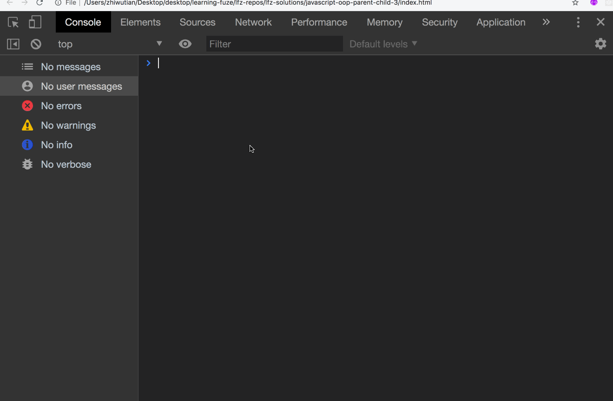
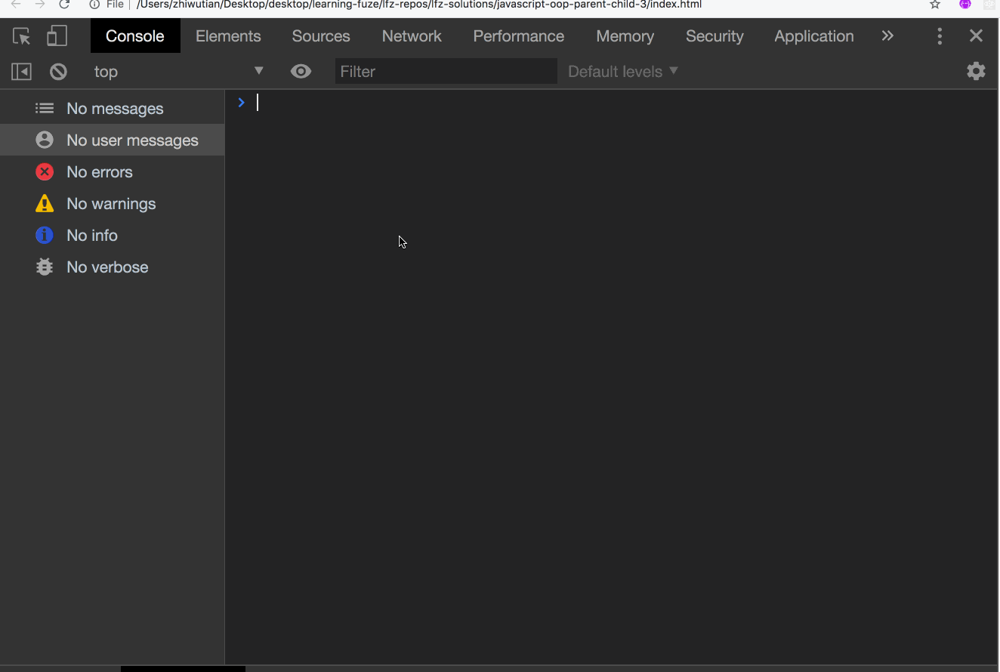

# javascript-oop-parent-child-3

Now that you are able to instantiate child objects and pass them callback functions to allow intra-object communication, it is time for another important feature of OOP, multiple files!

Because two of the principal reasons for using OOP are the ability to cleanly organize and encapsulate code, it is very common for classes to be created in individual files.

To practice writing code in this way, this exercise will require you to create separate files for each of your classes, and to import them into your `index.html` file in the correct order. Also, you will be creating a `Maker` class which will instantiate the `Parent` class, and creating a `callback` function, `refreshFood` which will be used by the `Parent` class to request more food when all food has run out.

So, let's get started!

### Before You Begin

Be sure to check out a new branch (**from master**) for this exercise. Detailed instructions can be found [**here**](../../guides/before-each-exercise.md).

### Exercise

1. Create the following files in the `javascript-oop-parent-child-3` folder:
    - `index.html`
    - `main.js`
    - `maker.js`
    - `parent.js`
    - `child.js`
2. Recreate the `Child` and `Parent` classes from `Parent-Child-2` in the appropriate files.
3. When you have completed creating the `Child` and `Parent` classes:
    - Instantiate the `Parent` class in the `main.js` file as in the previous 2 exercises.
    - In the `index.html` file:
        - load the `script` tags for the `main.js`, `parent.js`, and `child.js` in the proper order.
            - `Remember!`, you must load your JS files so that the code being run in each file has access to the code it needs to run from any other JS files!
            - Example: if you want to instantiate a class within another class, the class you wish to instantiate must be loaded before the class which will perform the instantiation!
            - Note: check the console for errors during this process!
        - Once you have loaded the files in the proper order, use the same tests from the previous exercise to confirm all of the previous functionality is working correctly!
        - Example previous functionality:
        
        - When the previous functionality is confirmed, move on to the next step!
4. In the `maker.js` file do the following:
    - declare a new class named `Maker`
    - Within the `Maker` class:
        - Give the `constructor` the following parameters:
            - `parentFName` which will receive the parent's first name (string)
            - `parentLName` which will receive the parent's last name (string)
            - `parentAge` which will receive the parent's age (number)
            - `parentJob` which will receive the parent's job (string)
            - `parentChildName` which will receive the parent's child's name (string)
             - Note: this should look familiar, as it is all the same information which you pass to the `Parent` class currently when you instantiate it. As the `Maker` class will now be instantiating the parent, you must give all the parent information to the `Maker` class!
        - Now, Instantiate the `Parent` class within the constructor with the appropriate arguments, and assign the returned object to a property named `this.parent`.
        - Next, create a new method on the `Maker` class named `replenishFood`
            - `NOTE` This method will be passed into the `Parent` class when it is instantiated and used by the instantiated parent to refresh the food supply in the `this.food` property
            - Within the `replenishFood` method:
                - increment the value of the instantiated parent's `this.food` property by 5
                - log to the console that the food supply has been replenished.
            - It is time to test!
                - in the `main.js` file:
                    - instead of instantiating the `Parent` class, instantiate the `Maker` class with the same arguments and store the returned object in a variable named `maker`.
                - in the `index.html` file:
                    - load the `script` tag for the `maker.js` in the proper order relative to the other `JS` files so that each file load correctly without errors.
                - When the files are loaded in the proper order:
                    - Test the `replenishFood` method in the console.
                    - Example functionality:
                    
                - when the `Maker` class is being properly instantiated and the `replenishFood` method is properly increasing the value of the instantiated parent's `this.food` property, move on to the next step!
        - Now, add the `this.replenishFood` callback to the list of arguments being passed to the `Parent` class when it is instantiated within the `Maker` class.
            - `Remember` that since the `replenishFood` method will be called by the `Parent` class, you must bind it in the same way you bound the `feedChild` method in the `Parent` class of the previous exercise!
        - This concludes the work in the `Maker` class.
5. In the `parent.js` file, do the following:
    - Add a new parameter to the constructor named `foodCallback` to receive the `replenishFood` callback method when the `Parent` class is instantiated
    - Create a new property in the constructor named `this.foodCallback` to store the `foodCallback` method.
    - Create a new method named `askForReplenishment`
        - Within the `askForReplenishment` method:
            - log to the console a plea to the maker for more food
            - call the `foodCallback` method to update the value of the `this.food` property
    - It is time to test!
    - Example functionality:
    
    - When the above functionality is complete, congratulations! you have completed the creation of the `Maker` class and added the functionality for the instantiated parent to receive more food once the instantiated child has eaten all of the available food!
        - You have also shown that you can properly load script files in the correct order!!!
    - Move on to the `Final Functionality` section below!!

## Final Functionality Check
- Below is the final functionality example:
    

    - Note: you will notice a pause between the request for food and the response, this was done with a setTimeout in the `askForReplenishment` method when calling the `foodCallback` to provide a sense of drama, give it a try!
- When you have all of the above functionality completed, Congratulations! you can now:
    - instantiate classes within other class
    - pass in callback functions to children so they can communicate with parents and send information back and forth
    - properly load multiple JS files in the proper order
- Very Well done!!!
- Move on to the `Submitting Your Solution` section below.

### Submitting Your Solution

When your solution is complete, change directories to the root of your lessons repository. Then commit your changes, push, and submit a Pull Request on GitHub. Detailed instructions can be found [**here**](../../guides/after-each-exercise.md).

### Quiz

- Why did the `Maker` class require all of the `Parent` class info?
- Why did you have to bind `this` for the `replenishFood` method.
- What decides the order in which JS files must be loaded?
