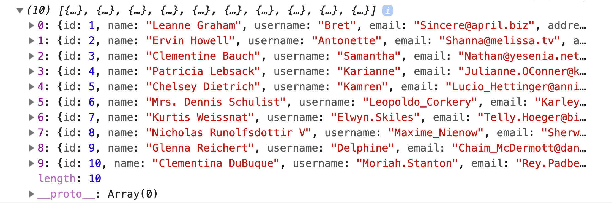
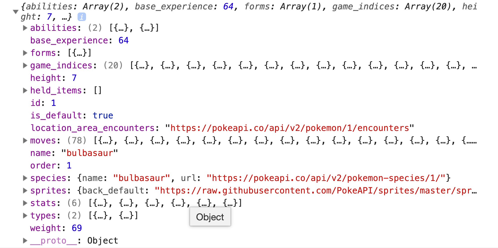

# ajax

Using `ajax` to send HTTP requests from the browser.

### Before You Begin

Be sure to check out a new branch (from `master`) for this exercise. Detailed instructions can be found [**here**](../../guides/before-each-exercise.md). Then navigate to the `exercises/jquery-ajax-1` directory in your terminal.

### Exercise

1. Read about `ajax` on pages 372, 388, 398, and 399 in _JavaScript and jQuery_ by Duckett.

1. Read about [`$.ajax()`](https://api.jquery.com/jquery.ajax/) in the jquery Docs.

1. Create an `index.html` and add a basic [HTML Skeleton](../html-skeleton/README.md).

1. Add a `<script>` tag at bottom of your `<body>` tag like so:

    ```html
      <body>
      <!-- your html goes here -->


      <script>
      //your javascript code goes here
      </script>
      </body>
    ```

    You may also create a `main.js` file and link it your `index.html` using a `<script>` tag.  However it must be linked at the bottom of the `<body>`.

1. At the bottom of your `<body>` tag, before your own `<script>` tag, add a `<script>` tag with the jQuery CDN.

    ```html
      <body>
      <!-- your html goes here -->

      <script src="https://code.jquery.com/jquery-3.4.1.js"></script>
      <script>
      //your javascript code goes here
      </script>
      </body>
    ```
    For more information on linking the jQuery library to your application please read pages 354 and 355 in _JavaScript and jQuery_ by Duckett.

1. Within `main.js` or `<script>` tag, use `$.ajax()` to send a `GET` request to `https://jsonplaceholder.typicode.com/users`, and log the `Array` of user objects to the console.

1. **Alternatively**, use `$.ajax()` to send a `GET` request to [the PokéAPI](https://pokeapi.co/docs/v2.html#pokemon) to retrieve your favorite pokémon and log its data to the console. *e.g* `https://pokeapi.co/api/v2/pokemon/1`





### Submitting Your Solution

When your solution is complete, return to the root of your `lfz-lessons` directory. Then commit your changes, push, and submit a Pull Request on GitHub. Detailed instructions can be found [**here**](../../guides/after-each-exercise.md).

### Quiz

- How does `ajax` work?
- Why did we need the jQuery CDN?
- How do you specify the request method (`GET`, `POST`, etc.) when calling `ajax`?
