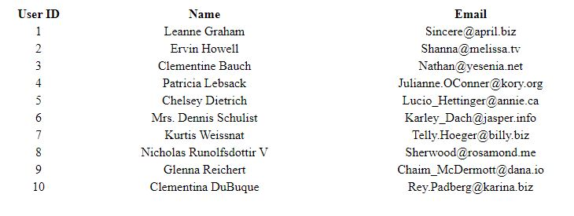

# ajax

Using `ajax` to send HTTP requests from the browser along with JS Dom Creation.

### Before You Begin

Be sure to check out a new branch (from `master`) for this exercise. Detailed instructions can be found [**here**](../../guides/before-each-exercise.md). Then navigate to the `exercises/jquery-ajax-2` directory in your terminal.

### Exercise

1. There is no reading material in this exercise, it uses the same concepts you learned in your last exercise along with a couple more challenging tasks.  If you would like a refresher please read about `ajax` on pages 372, 388, 398, and 399 in _JavaScript and jQuery_ by Duckett and checkout [`$.ajax()`](https://api.jquery.com/jquery.ajax/) in the jQuery Docs.

1. Take a look at the `index.html` file for the code that has been provided for you.  The base html and styling has been created for you since the goal in this exercise is to learn http requests and dom creation.

1. Take a look at the solution below:

    

      
    

1. Within `main.js`, use `$.ajax()` to send a `GET` request to `https://jsonplaceholder.typicode.com/users`, and use JavaScript to manipulate the user data from the response and try to recreate the solution.

### Submitting Your Solution

When your solution is complete, return to the root of your `lfz-lessons` directory. Then commit your changes, push, and submit a Pull Request on GitHub. Detailed instructions can be found [**here**](../../guides/after-each-exercise.md).
