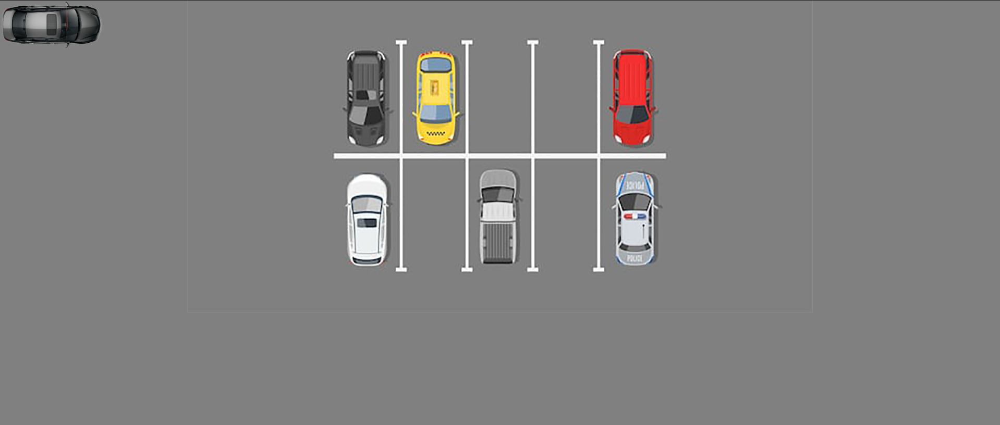
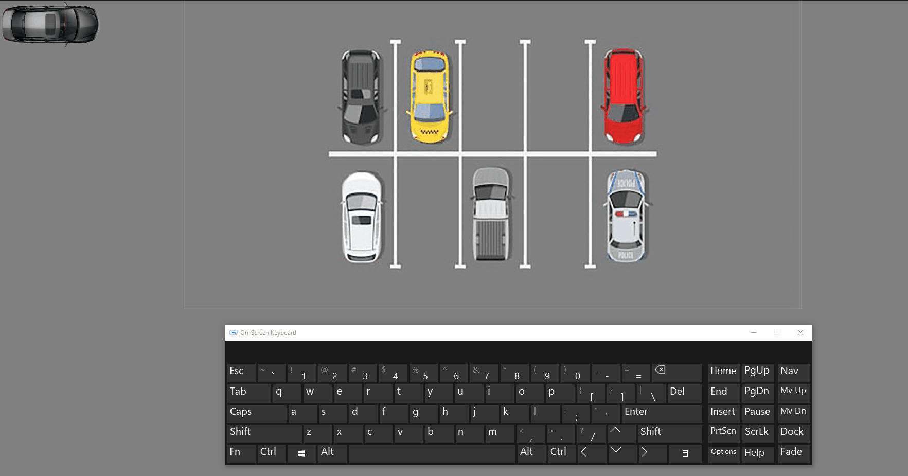
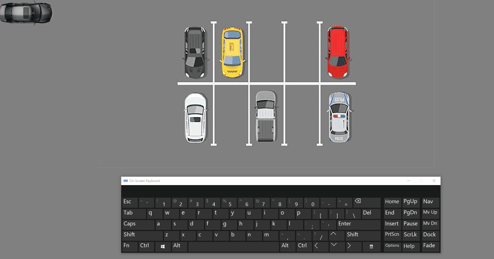
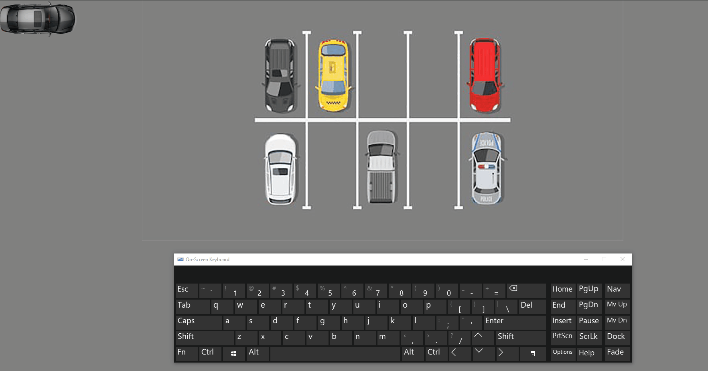
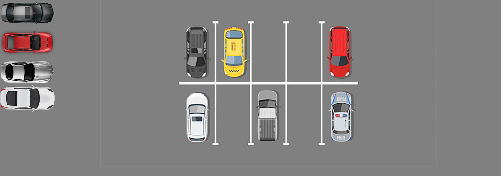
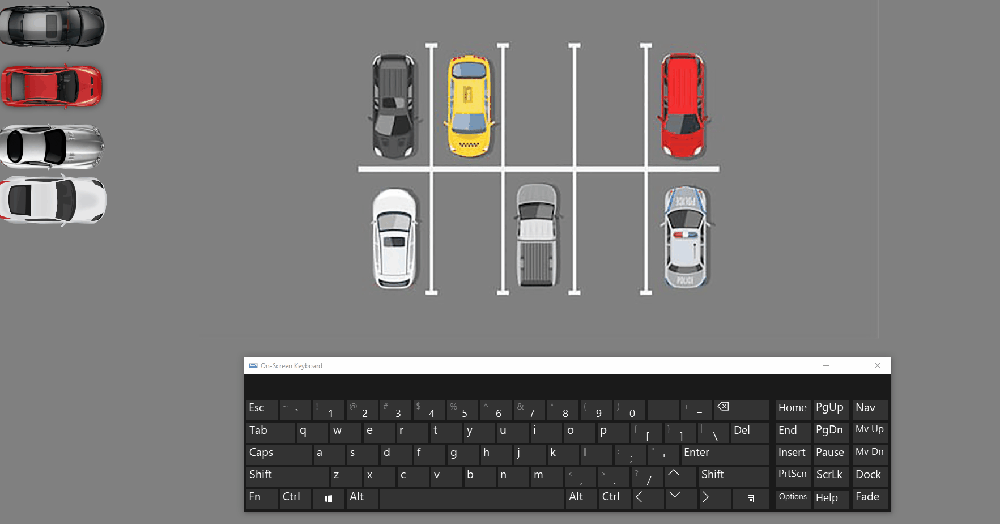

# oop-parking-challenge

Using Object Oriented JavaScript to create a `Parking` game.

### Before You Begin

Be sure to check out a new branch (from `master`) for this exercise. Detailed instructions can be found [**here**](../../guides/before-each-exercise.md). Then navigate to the `exercises/oop-parking-challenge` directory in your terminal.

### Challenge

Use Object Oriented JavaScript to create a `Parking` game that can create a car, drive the car, and turn the car.

All challenges done in oop may be accomplished in different ways.  The following are how we expect your application to be layed out, but of course your end solution may differ.  Be sure to question the differences in the solution provided after this challenge is given to you.

### Feature List

  - [User can see their car](#user-can-see-their-car)
  - [User can start their car](#user-can-start-their-car)
  - [User can stop their car](#user-can-stop-their-car)
  - [User can turn their car](#user-can-turn-their-car)

## Mockup

### User can see their car

  This feature is completed when you spawn a car on the dom.  This can be done dynamically or using html.  In our example it was done using JS.  The position, direction, and color of your car may differ depending on your code.  The parked cars in the screenshot is just a background image that is provided for you `images/parking-lot.jpg`.

### References

- [querySelector](https://developer.mozilla.org/en-US/docs/Web/API/Document/querySelector)
- [createElement](https://developer.mozilla.org/en-US/docs/Web/API/Document/createElement)
- [appendChild](https://developer.mozilla.org/en-US/docs/Web/API/Node/appendChild)

### User can start their car

  This feature is completed when you press the `space bar` and your car starts driving off in one direction. The direction, speed, and color of the car may differ depending on your code.  The keyboard in the gif is just an example keyboard to simulate the `space bar` press.

### References

- [event.key](https://developer.mozilla.org/en-US/docs/Web/API/KeyboardEvent/key)
- [keydown event](https://developer.mozilla.org/en-US/docs/Web/API/Document/keydown_event)
- [setInterval](https://developer.mozilla.org/en-US/docs/Web/API/WindowOrWorkerGlobalScope/setInterval)
- [addEventListener](https://developer.mozilla.org/en-US/docs/Web/API/EventTarget/addEventListener)

### User can stop their car

  This feature is completed when you press the space bar and your car starts driving off in one direction and once you press the space bar again the car stops driving in that direction.  The direction, speed, and color of the car may differ depending on your code.

### References

- [event.key](https://developer.mozilla.org/en-US/docs/Web/API/KeyboardEvent/key)
- [keydown event](https://developer.mozilla.org/en-US/docs/Web/API/Document/keydown_event)
- [clearInterval](https://developer.mozilla.org/en-US/docs/Web/API/WindowOrWorkerGlobalScope/clearInterval)
- [addEventListener](https://developer.mozilla.org/en-US/docs/Web/API/EventTarget/addEventListener)

### User can turn their car

  This feature is completed when you press the arrow keys on your keyboard (:arrow_up: :arrow_down: :arrow_left: :arrow_right:) and your car turns in said direction.  Please check your `style.css` file, there are classes that were predefined to help you with this feature. The color of the car may differ depending on your code.

### References

- [event.key](https://developer.mozilla.org/en-US/docs/Web/API/KeyboardEvent/key)
- [keydown event](https://developer.mozilla.org/en-US/docs/Web/API/Document/keydown_event)
- [style property](https://developer.mozilla.org/en-US/docs/Web/API/ElementCSSInlineStyle/style)
- [Function.prototype.bind()](https://developer.mozilla.org/en-US/docs/Web/JavaScript/Reference/Global_objects/Function/bind)

### Submitting Your Solution

When your solution is complete, return to the root of your `lfz-lessons` directory. Then commit your changes, push, and submit a Pull Request on GitHub. Detailed instructions can be found [**here**](../../guides/after-each-exercise.md).

___

### Stretch Feature List

**These features can only be attempted after you have submitted your initial solution.  Do not attempt if you have not completed the initial solution.  Make sure to checkout to a new branch before attempting these for the sake of preserving your working code base.**

- [User can see multiple cars](#user-can-see-multiple-cars)
- [User can drive multiple cars](#user-can-drive-multiple-cars)

### User can see multiple cars

  This feature is completed when you spawn multiple cars on the dom.  This more than likely will require a refactor in your code somewhere to support multiple cars.  The position, direction, and colors of your cars may differ depending on your code.

### References

- [querySelector](https://developer.mozilla.org/en-US/docs/Web/API/Document/querySelector)
- [createElement](https://developer.mozilla.org/en-US/docs/Web/API/Document/createElement)
- [appendChild](https://developer.mozilla.org/en-US/docs/Web/API/Node/appendChild)

### User can drive multiple cars

  This feature is completed when you can drive your car and switch between them using the backtick key ( ` ). Keep in mind that you should be able to switch back to the first car after the last car was selected.  The position, direction, speed, and colors of your cars may differ depending on your code.

### References

- [event.key](https://developer.mozilla.org/en-US/docs/Web/API/KeyboardEvent/key)
- [keydown event](https://developer.mozilla.org/en-US/docs/Web/API/Document/keydown_event)
- [style property](https://developer.mozilla.org/en-US/docs/Web/API/ElementCSSInlineStyle/style)
- [Function.prototype.bind()](https://developer.mozilla.org/en-US/docs/Web/JavaScript/Reference/Global_objects/Function/bind)
- [setInterval](https://developer.mozilla.org/en-US/docs/Web/API/WindowOrWorkerGlobalScope/setInterval)
- [clearInterval](https://developer.mozilla.org/en-US/docs/Web/API/WindowOrWorkerGlobalScope/clearInterval)
- [addEventListener](https://developer.mozilla.org/en-US/docs/Web/API/EventTarget/addEventListener)

### Submitting Your Solution

When your solution is complete, return to the root of your `lfz-lessons` directory. Then commit your changes, push, and submit a Pull Request on GitHub. This will be a separate pull request from your original submission. Detailed instructions can be found [**here**](../../guides/after-each-exercise.md).
