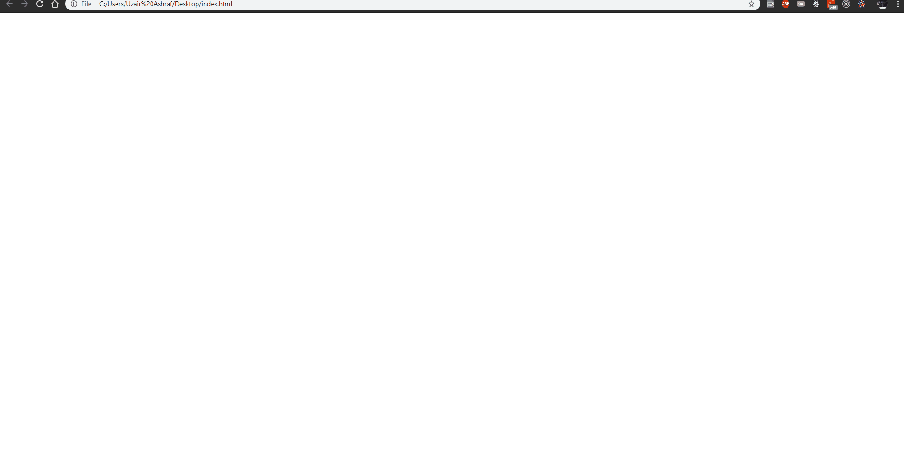

Logging to the Console
--

This guide is to show you how to use `console.log` to output your code to the inspector.

### What is the Console?

The console is used as a debugging tool.  The Javascript console will tell you when there is problem with a script, where to look for the problem, and what kind of issue it seems to be.

### How to show the console in your browser.

All browsers have their own developer tools.  The one you will be using is the Chrome browser.

The shortcut on Windows to use the developer tools is `Ctrl + Shift + i` .  On mac it is `Alt + Cmd + j`.  You can also right click the page and click inspect like in the example below.

For more information on Browser Developer Tools with other browsers please read pages 464-465 of _Javascript & jQuery_ by Duckett.

### How to use `console.log()`

Here is a small example of an `html` file with a `<script>` tag:

When the browser parses the html file, it executes any JavaScript code linked to the `<script>` tag.

In the next example we see a `variable` declared and a call to the `log` method of the `console` object.

When the JavaScript file executes, anything that was passed in as an argument to the log method will be logged to the console.

The `console.log()` method can write several values to the console at the same time.  It is best practice to label what ever you are logging to the console for easier debugging.

This is logging without labels:

Here it is with labels:

### Reminder

`console.log()` is a powerful tool for debugging and an easy way to show your code in the browser.  But remember, you should always remove this kind of error handling code from your script before you use it on a live site.

To learn more about the console you can read pages 470-471 of _Javascript & jQuery_ by Duckett.
